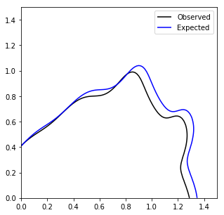

[](https://travis-ci.org/irinaespejo/excursion)
[](https://zenodo.org/badge/latestdoi/146087019)
[](https://github.com/psf/black)
[](https://opensource.org/licenses/Apache-2.0)

# `excursion` — Efficient Excursion Set Estimation 
[ReadTheDocs](https://excursion.readthedocs.io/en/latest/)

This package implements a Bayesian Optimization procedure based on Gaussian Processes to efficiently determine excursion sets (or equivalently iso-surfaces) of one or many expensive black-box functions.

## Installation and Example

Install via `pip install excursion==0.0.1a0`.

To estimate excursion sets for `N_FUNCS=2` functions simultaneously run:

```python
for index in range(N_UPDATES):
	# construct an estimate for each of the functions
	gps = [excursion.get_gp(X,y_list[i]) for i in range(N_FUNCS)]

    # determine new point(s) at which to evaluate
    newx, acqvals = excursion.optimize.gridsearch(gps, X, scandetails)

    # evaluate each black-box function
    newys_list = [expensive_functions[i](np.asarray([newx])) for i in range(N_FUNCS)]

    # update data
    for i,newys in enumerate(newys_list):
        y_list[i] = np.concatenate([y_list[i],newys])
    X = np.concatenate([X,np.array([newx])])
```

## Ex: Finding two-dimensional Contours in High-Energy Physics

In this example, modeled after typical exclusion contours of high-energy physics searches, we are insterested in estimating two excursion sets

1. the **excluded** set of points -- theories of physics incompatible with the data
2. the **non-excluded** set of points -- theories that are still viable.

Typically two simultaneous labels can be assigned, the *expected* and *observed* status of a given theory. The label can be computed through computationally expensive Monte Carlo simulation. Points to be simulated are therefore picked to most efficiently estimate both the *expected* and *observed* excursion sets.



### Point Seqeuence


## Talks:

* 4th Reinterpretation Workshop [Slides](https://indico.cern.ch/event/702612/contributions/2958660/attachments/1649620/2638023/Contours.pdf)

## Authors

* Lukas Heinrich, CERN
* Gilles Louppe, U Liege
* Kyle Cranmer, NYU
